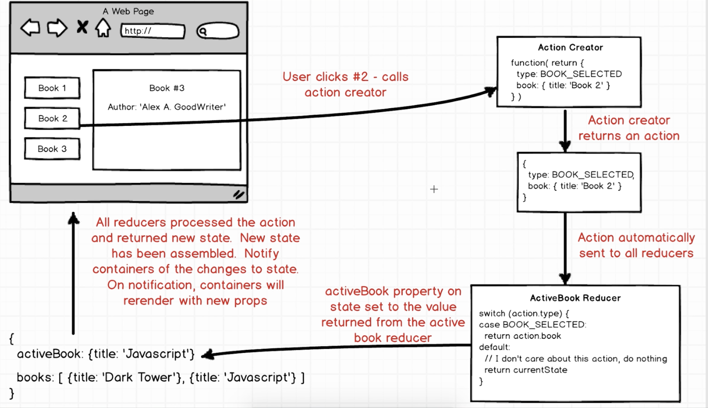

# ReduxSimpleStarter

Interested in learning [Redux](https://www.udemy.com/react-redux/)?

### Getting Started

There are two methods for getting started with this repo.

#### Familiar with Git?
Checkout this repo, install dependencies, then start the gulp process with the following:

```
> git clone https://github.com/StephenGrider/ReduxSimpleStarter.git
> cd ReduxSimpleStarter
> npm install
> npm start
```

#### Not Familiar with Git?
Click [here](https://github.com/StephenGrider/ReactStarter/releases) then download the .zip file.  Extract the contents of the zip file, then open your terminal, change to the project directory, and:

```
> npm install
> npm start
```


1. User clicks #2 - call action creator
2. Action creator returns an action
3. Action automatically sent to all reducers
4. activeBook property on state set to the value returned from the active book reducer
5. All reducers processed the action and returned new state. New state has been assembled. Notify containers of the changes to state. 
On notification, containers will rerender with new props.